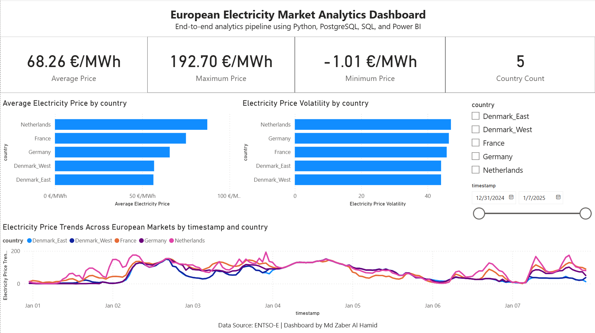

# European Electricity Market Analytics Pipeline

## Overview

This project is an end-to-end European energy analytics pipeline built using Python, PostgreSQL, SQL, and Power BI.

The system collects electricity market price data from multiple European countries, transforms and stores the data in PostgreSQL, performs analytical SQL queries, and visualizes key market insights through an interactive Power BI dashboard.

The project was designed to simulate a real-world analytics engineering workflow and demonstrate practical skills relevant to Data Analyst, BI Analyst, Data Engineer, and Analytics Engineer roles.

---

# Project Objectives

* Build a complete ETL data pipeline using Python
* Store structured energy market data inside PostgreSQL
* Perform analytical SQL queries for market insights
* Develop an interactive Power BI dashboard
* Demonstrate real-world analytics engineering practices
* Create a portfolio-ready end-to-end project

---

# Dashboard Preview

## Executive Dashboard



---

# Tech Stack

| Category              | Technology                  |
| --------------------- | --------------------------- |
| Programming           | Python                      |
| Data Processing       | Pandas                      |
| Database              | PostgreSQL                  |
| Database Driver       | SQLAlchemy, psycopg2        |
| Environment Variables | python-dotenv               |
| Data Visualization    | Power BI                    |
| Version Control       | Git + GitHub                |
| API Data Source       | ENTSO-E / Energy Market API |

---

# Project Architecture

```text
API Data Source
       ↓
Python Extraction Layer
       ↓
Raw CSV Storage
       ↓
Data Cleaning & Transformation
       ↓
Processed Dataset
       ↓
PostgreSQL Database
       ↓
SQL Analytics Layer
       ↓
Power BI Dashboard
```

---

# Project Structure

```text
EUROPEAN-ENERGY-PIPELINE/
│
├── airflow/
├── dashboard/
│   └── powerbi/
│       └── europe_energy_dashboard.pbix
│
├── data/
│   ├── raw/
│   ├── processed/
│   └── exports/
│
├── docker/
├── docs/
│   └── dashboard_preview.png
│
├── notebooks/
│   └── 01_api_exploration.ipynb
│
├── sql/
│   └── analytics/
│       ├── average_price_by_country.sql
│       ├── country_price_comparison.sql
│       ├── daily_average_prices.sql
│       ├── highest_price_hours.sql
│       └── price_volatility.sql
│
├── src/
│   ├── config/
│   ├── extract/
│   ├── transform/
│   ├── load/
│   └── utils/
│
├── tests/
├── .env
├── .gitignore
├── requirements.txt
└── README.md
```

---

# ETL Pipeline Workflow

## 1. Data Extraction

Electricity price data is fetched from European energy market APIs using Python.

Countries included:

* Germany
* Denmark West
* Denmark East
* France
* Netherlands

The extracted raw data is stored in:

```text
/data/raw/
```

---

## 2. Data Transformation

The transformation layer performs:

* Timestamp conversion
* Missing value handling
* Data sorting
* Dataset cleaning
* Standardized formatting

Processed datasets are saved in:

```text
/data/processed/
```

---

## 3. PostgreSQL Loading

The cleaned dataset is loaded into PostgreSQL using:

* SQLAlchemy
* psycopg2

Database table:

```sql
energy_prices
```

---

## 4. SQL Analytics Layer

Analytical SQL queries were created to generate business insights.

Examples include:

* Average electricity price by country
* Price volatility analysis
* Daily average trends
* Peak electricity price hours
* Cross-country market comparison

---

# Power BI Dashboard

The dashboard provides:

* Executive KPI overview
* Country-wise electricity price comparison
* Market volatility analysis
* Interactive filtering
* Multi-country time-series trends

Key KPIs:

* Average Price
* Maximum Price
* Minimum Price
* Country Count

---

# Example SQL Query

```sql
SELECT
    country,
    ROUND(AVG(price_eur_mwh)::numeric, 2) AS avg_price
FROM energy_prices
GROUP BY country
ORDER BY avg_price DESC;
```

---

# Key Insights

* The Netherlands showed the highest average electricity prices in the analyzed period.
* Denmark East had comparatively lower average market prices.
* Electricity markets demonstrated clear volatility spikes during peak periods.
* Cross-country energy trends reveal different market behaviors and pricing stability.

---

# Future Improvements

Planned improvements for future versions:

* Docker containerization
* Apache Airflow orchestration
* Automated scheduling
* CI/CD integration
* Cloud deployment
* Real-time streaming data
* Advanced forecasting models

---

# How to Run the Project

## 1. Clone Repository

```bash
git clone https://github.com/mdzaberalhamid/european-energy-data-pipeline.git
cd european-energy-data-pipeline
```

---

## 2. Create Virtual Environment

```bash
python -m venv venv
```

Activate environment:

### Windows

```bash
venv\Scripts\activate
```

---

## 3. Install Dependencies

```bash
pip install -r requirements.txt
```

---

## 4. Configure Environment Variables

Create a `.env` file:

```env
DB_HOST=localhost
DB_PORT=5432
DB_NAME=energy_pipeline
DB_USER=postgres
DB_PASSWORD=your_password
```

---

## 5. Run ETL Pipeline

### Extract Data

```bash
python src/extract/fetch_europe_energy.py
```

### Transform Data

```bash
python src/transform/clean_energy_data.py
```

### Load Into PostgreSQL

```bash
python src/load/load_to_postgres.py
```

---

# Author

## Md Zaber Al Hamid

MSc Data Science Student

Interested in:

* Data Engineering
* Analytics Engineering
* Business Intelligence
* Machine Learning
* Data Analytics

LinkedIn: [https://www.linkedin.com/in/mdzaberalhamid](https://www.linkedin.com/in/mdzaberalhamid)

GitHub: [https://www.github.com/mdzaberalhamid](https://www.github.com/mdzaberalhamid)

---

# License

This project is for educational and portfolio purposes.
